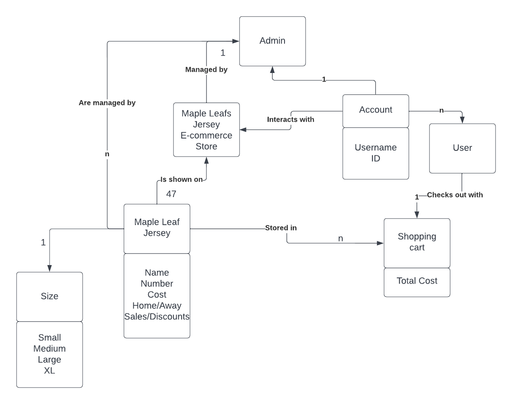
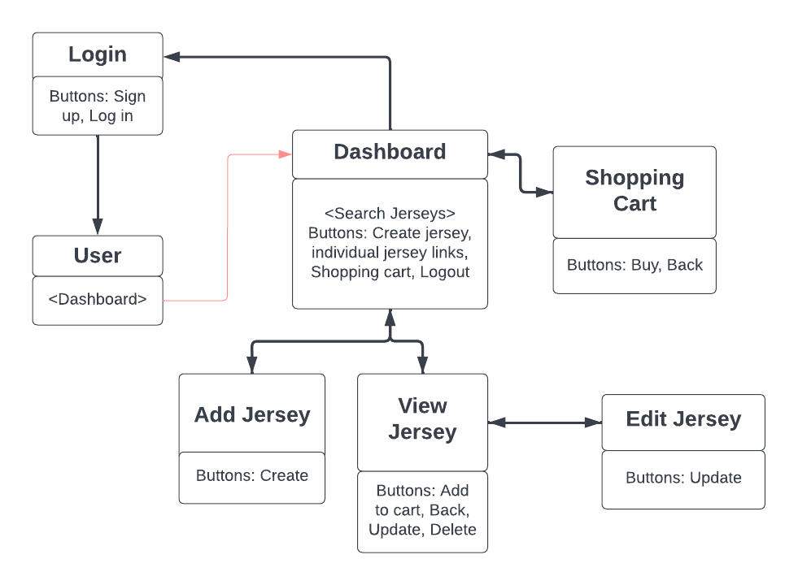
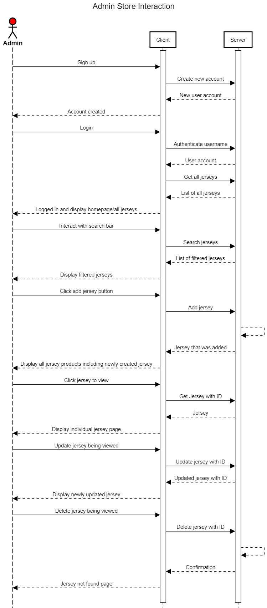
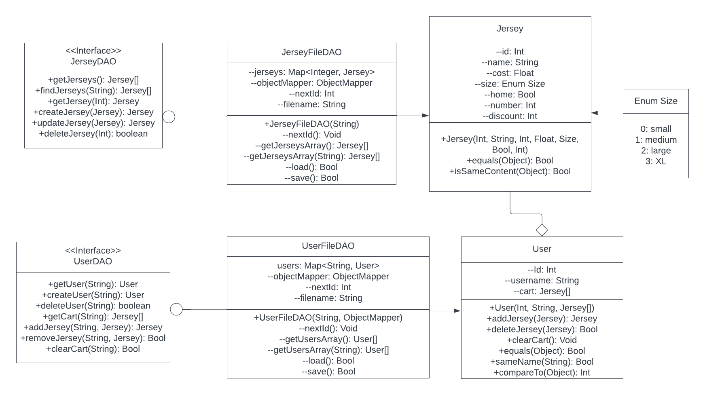
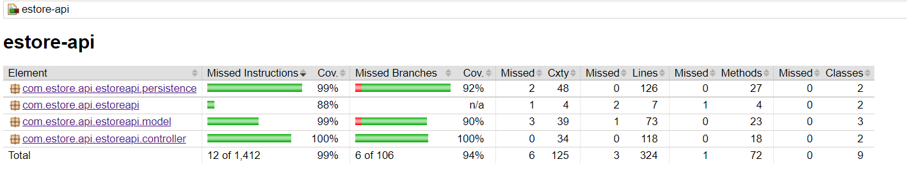

# PROJECT Design Documentation

## Team Information
* Team name: Toronto Maple Leafs
* Team members
  * Domenic Lo Iacono
  * Niccolls Evsseef
  * Claire Kreisel
  * Ming Creekmore

## Executive Summary

This project is a full stack application including a persistent storage, backend, and user interface. 
The goal of this application is to host a jersey store for the Toronto Maple Leafs. 
General features of the application include logging in and out, browsing the available jerseys for sale, and viewing individual jersey pages with all the jersey's attributes. 
There are two different accounts: admin and user. An admin is able to manage the site by adding and removing jerseys and editing existing jerseys. Users are able to add and remove items from their shopping cart and buy all the items in the cart.

### Purpose
This website has an admin that is able to modify the stock of jerseys that are for sale by adding jerseys, removing jerseys, and editing existing jerseys. 
The website also has users which have a username and a shopping cart which is persistent after logout. Users are able to add and remove items from their shopping cart. 

### Glossary and Acronyms

| Term | Definition |
|------|------------|
| Admin | Website owner with special privlidges related to the inventory of jerseys. |
| User | A customer that interacts with the website and has a username and shopping cart. |
| Jersey | The type of product that is being sold at the E-Store |
| SPA | Single Page |
| DAO | Data access object |

## Requirements

Requirements consisted of giving admin the ability to modify the inventory, allowing users to modify their shopping cart, and providing general viewing and browsing of the the jersey products in the store.

   

| Epic | Stories |
|------|------------|
| Admin Management | <ul><li>Login</li><li>Browse Products</li><li>Search Products</li><li>Edit Jerseys in Store</li><li>Add Jerseys to Store</li><li>Delete Jerseys From Store</li></ul> |
| User Interacting with Store | <ul><li>Login</li><li>Browse Products</li> <li>Search Products</li><li>Buyer Add/Remove from Cart</li><li>Buyer Save to Cart</li></ul> |
| Jersey in Store | <ul><li>View Jersey</li><li>Browse Products</li><li>Search Products</li><li>User: Jerseys Shown in Cart</li></ul> |

### Definition of MVP
The admin and users must be able to login. New users are able to register new accounts.
The admin must be able to preform CRUD operations on the stock of jerseys which is persistently stored.
The user must be able to add, delete, and checkout their shopping cart which also must be persistently stored. 
The website must allow quick and easy access to the products with a postive user experince. 

### MVP Features and the names of their stories
Admin management - allowing the admin to modify the inventory 
User interacting with store - allowing users to modify their shopping cart, as well as saving the shopping cart after logout 
Jerseys in the store - allowing any account to browse, search, and view jersey products

### Roadmap of Enhancements
<ol><li>Add images to accompany jerseys</li><li>Admin can view all users and delete accounts</li>
<li>Users can delete their account</li>
<li>Changing 10% feature to be able to apply throughout the store</li></ol>

## Application Domain

In the domain, it shows that the website has two different types of accounts that can interact with it: admin and user. There is only one admin. The admin manages the store and the jerseys. In contrast, there are many users who interact with the store by storing jerseys in their individual shopping cart. The user can check out with the shopping cart in order to buy the stored jersey items.

This is a Noun/Verb analysis relating to our domain model which is now represented in code through various classes. 

| Noun | Attributes |
|------|------------|
| Jerseys | <ul><li>Name</li><li>Number</li><li>Cost</li><li>Home/Away</li><li>Sales/Discounts/</li><li>Size: Small, Medium, Large, XL</li> |
| Store | |
| Account | <ul><li>Username</li><li>ID</li></ul>|
| Admin | |
| User | |
| Shopping Cart | <ul><li>Total Cost</li></ul> |

Verbs:
  <ul><li>Managed by</li><li>Are managed by</li><li>Interacts with</li><li>Checks out with</li><li>Is shown in</li><li>Is an attribute of</li><li>Stored in</li>

## Architecture and Design
The backend uses SpringBoot to build an API using a model-controller-DAOfile setup. The model holds the blueprint for an object, the DAOfile persistently stores and modifies data objects in a JSON file, and the controller allows outside clients to perform actions on the data. Jerseys and Users are both managed using this model-controller-DAOfile build. Furthermore, the backend prioritizes the use of the design principles single responsibility, information expert, and dependency injection.

The frontend is built using angular. The jersey.service.ts and user.service.ts files are able to access the backend data and share the data to other files in the project. These parts are built using typescript. The typescript can then be used in the html to connect the backend data to the UI. CSS is added to the html to add aesthetics. 

### Summary

The following Tiers/Layers model shows a high-level view of the webapp's architecture.

The e-store web application, is built using the Model–View–ViewModel (MVVM) architecture pattern. 
The Model stores the application data objects including any functionality to provide persistance. 
The View is the client-side SPA built with Angular utilizing HTML, CSS and TypeScript. The ViewModel provides RESTful APIs to the client (View) as well as any logic required to manipulate the data objects from the Model.
Both the ViewModel and Model are built using Java and Spring Framework. Details of the components within these tiers are supplied in the sections below.

Model and the backend part of View-Model tier follow the design principles: single responsibility, information expert, and dependency injection. Single responsibility is shown through each specialized class having a specialized job. Information expert is shown through each class having control over the data that they access. Dependency injection is shown through using interfaces for DAO.

### Overview of User Interface

The user and admin have almost identical flows through the application. The user is only different than that of the admin by the fact that they are unable to see the CRUD operation buttons when viewing a jersey and that they have a shopping car.
Any person first lands on a login page when visiting the site. 
Upon login, after registration if neccessary, a user is directed to a page that displays the stock of jerseys that can be filtered using the search bar, a shopping cart icon, a logout icon, and the username of whoever is currently logged in. From here they are able to view jerseys and add them to their cart. They are also able to view their shopping cart and remove items from cart, or buy all the items in the cart.

As stated before, admin has an almost identical website experience as a user. The difference is that on the browsing jersey page, there is no shopping cart. Instead, there is a create jersey button. Furthermore, when viewing an individual jersey, they can edit or delete it. They cannot buy an individual jersey because they don't have a shopping cart.

### View Tier

Note: The app-components admin and browse-jersey are not used in the web-app. The components in the tier that are used include login, user, dashboard, search-jerseys, add-jersey, view-jersey, shopping-cart, and edit-jersey. 

Login is where the user is directed to when they first enter the website. It has a username and login screen with basic authentication. When the user is authenticated, then the app routes to the user component, which routes to the dashboard component. The dashboard component consists of the search-jerseys component, an add jersey button, a shopping cart button, and logout button. These buttons route to the respective component names. The search-jerseys component all jerseys that fit the filtered name, with spaces returning all jerseys. Each jersey name displayed, routes to that specific jerseys view-jersey page.

The view jersey page consists of the buttons: Back, Add to Cart, Update, and Delete. Update routes to edit-jersey component, then back to view-jersey. The shopping cart component consists of the buttons, Back and Buy.
The diagrams below show the high-end diagram of the view tier routing just described

### ViewModel Tier

This tier involves the interaction between the client and the server. The user will first interact with the website, which is the client. This results in the client giving a call to the API server, which returns a response entity. Based on the response entity the client will update the website view accordingly.

The client is composed of the angular components that represent each individual html page as well as the user and jersey service. The user and jersey service are what call the API. The API server is composed of the UserController and the JerseyController. The user parts deal with logging in the user and updating the shopping cart of the specified user. The jersey parts deal with updating the inventory.
Below are two sequence diagrams that show how the admin and user interact with the server and client. The user sequence diagram does not include logging in, searching jerseys, and viewing jerseys because it is the same as what is shown in the admin sequence diagram.

 

### Model Tier

The model tier consists of the object classes User and Jersey, as well as the persistence DAO classes. The object classes are definitions for user and jersey objects. The DAOs use these definition classes in order to create a JSON file backend that stores these types of objects. Below is a UML diagram of these classes, along with an arrow legend.

The user equals method will show that users are equal if they have the same username. The user compareTo method compares the IDs of a user. The jersey equals methods will show that jerseys are equal if they have the same ID. This method is meant to be used in checking inventory. However, it cannot be used to check if jersey conflicts occur when adding a new jersey. The isSameContent method takes care of this by comparing all jersey attributes except the size and id. The size is left out because the backend store has an unlimited amount of all jerseys so we can assume that all sizes are included in the backend. Size only matters when a user picks the size of a jersey and adds it to the cart.

Note that some of the methods in the UserFileDAO are not actually called upon in the website. This includes deleteUser and both getUsersArray methods. This is because the site does not allow users to be deleted nor does it ever display all the users. Future improvements to the website could be to add utilization of these methods in the website. For example, we could allow the Admin to look at all the users and delete some if needed. We could also allow users to delete their account if they no longer wish to have one.

### Design Principles
The three design principles that are mainly focused on are single responsibility, information expert, and dependency injection.

Single responsibility is where each class should have a single, tightly focused responsibility. This applies to all classes in the backend. There are three classes that deal with jerseys and another three classes that deal with users. Each group of three classes is divided into the model, the persistence, and the controller. This allows each class to have a very specific role (model, persistence, or controller) for a specific object (jersey or user).

Information expert is the principle where behavior follows the data. This is shown in both the fileDAO classes and the user class. The user class holds a cart. Instead of having an outside force manually update the cart for the user, the user class instead has methods that implement cart changes and returns corresponding information. The jersey DAO manages its list of jersey and user DAO manages its list of users. Any changes to a user's cart is done by calling the user class's methods.

Dependency injection is done to provide looser coupling between dependent entities. This allows more flexibility in the code. Instead of having only one specific low-level module that is owned in a class, the class takes an injection (parameter) of a module that is needed. This injection could be a different implementation of the same type of module. This is displayed in the DAO interfaces, where it is known that any type of DAO will have those specific methods, but their implementation can be entirely different. For example, if we changed the JerseyFileDAO into a database. The databaseDAO methods would do the same thing but in a different way from the the JerseyFileDAO.

Although the above principles are followed well, there is one class that does not completely follow the principle information expert. In doing so, it also violates some other design principles not discussed, such as law of demeter. The problem resides within the getTotalCost method in UserController. This method should actually be implemented in the user model class, since total cost is a calculation using the data in the user's cart. However, due to rushed time, this principle was ignored. In the future, the total cost behavior should be moved to the user class.

Other parts where the design principle fails are in the frontend. Due to frontend being a language that is not object-oriented, most design principles that were considered for the backend are ignored in the frontend. However, it should be noted that one issue that is checked in the frontend is not checked in the backend. This is the issue of creating a bound for the discount of a jersey. In the backend, the user could input a discount of -10 or 110, which doesn't make sense in the context and would also give a wrong totalCost. This is taken care of in the frontend, but this violates the design principle information expert. In the future we should change this to work in the backend.

### Static Code Analysis/Design Improvements

Some design improvements that we would make as a team in the future would be to revaluate what methods and classes actually need to be public in order to funtion. This is highlighted in our report through 'code smells' as a majority of these alerts are in the test classes and are stating that the public status is most likely not needed. Other things that the analysis helped uncover is that we could use built in formatting to construct certian arguements in the controller classes. In a design improvement standpoint then, we will evaluate whether our code is protecting its data properly. 

One bug that was uncovered was an error in a test where there was an assert statement comparing a primitive value to null. This essentially makes the test useless as the assert statement will always be false as they are comparing two incompatible types. So in the future for design improvements we will give more attention to proofreading tests. 

The remaining two bugs are related to overriding the hashcode function of our two model objects User and Jersey. This insight gives us an idea of something to implement in the future. 

All in all, our design is far from perfect and would most likely benefit from a couple small changes here and there as highlighted above and in the design principle section and model tier section. The main points to focus on are cleaning up the code that is unused and changing our code to adhere to the design principles we are following.

There are also some high level design choices we made that we will also review to see if improvements can be made. One such high level design choice is our way of implementing users and their shopping carts. If it became increasingly difficult to manage added features or save the shopping cart in its current state as an attribute of the user then we would probably consider making the shopping cart its own separate class and separate persistence database/file. Of course, this would be very time consuming and the benefits to change it in this way may not be worth it or really exist at all. So more analysis is needed in order to determine if such a change is necessary. 

In addition, our most recent feature, discounts, may also have room to improve. Currently, the admin can apply a discount by going to the jersey's update page and changing the discount percentage. However, this may not be the best implementation as it requires the admin to go to each individual jersey to apply the discount. So if the admin was setting up a large clearance sale for instance, they would be frustrated with having to do all the jerseys separately. To remediate this, we could create a separate page for the admin to put in a percentage discount and then click to apply that discount to the appropriate jerseys. This page could even have the search bar to make finding the jerseys that the admin wants to discount easier to find. 

Another improvement that can be made is adding pictures to the jerseys. This will allow for a better user interface. It will also allow users to see the product they are buying instead of reading a description. It will also make it easier for the admin to know what they are trying to sell.

## Testing

Testing was done on the backend by using JUnit tests and test coverage was done using JaCoCo. Tests were made to follow the different branches that were made for each method. Only public methods were tested. If private methods were tested, they were done so indirectly. No testing was done on the UI component besides people going through the website. Acceptance testing was mainly determined to pass by going through the website or entering curl commands.

### Acceptance Testing
Acceptance criteria was made in the form GIVEN some precondition WHEN I do some action THEN I expect some result.
21 user stories have passed all their acceptance criteria tests. There are no stories that have failed tests, nor are there aany more stories on the product backlog.

### Unit Testing and Code Coverage

Unit testing was done by creating JUnit tests for each class. Each public method in a class was tested, where different branching routes of the method were tested via individual testing methods. Code coverage was calculated by JaCoCo. We selected a coverage target of 95% because we wanted most of the paths tested. The reason why it isn't 100% is because we felt that some of the paths added that we missed were part of the private methods that we didn't test and other paths tested instanceOf.
We were able to meet this code coverage result for persistence, model, and controller. Estore-API code coverage percentage was not met; it had a code coverage of 88%. This is because this was pre-provided for us and we didn't want to touch it.

